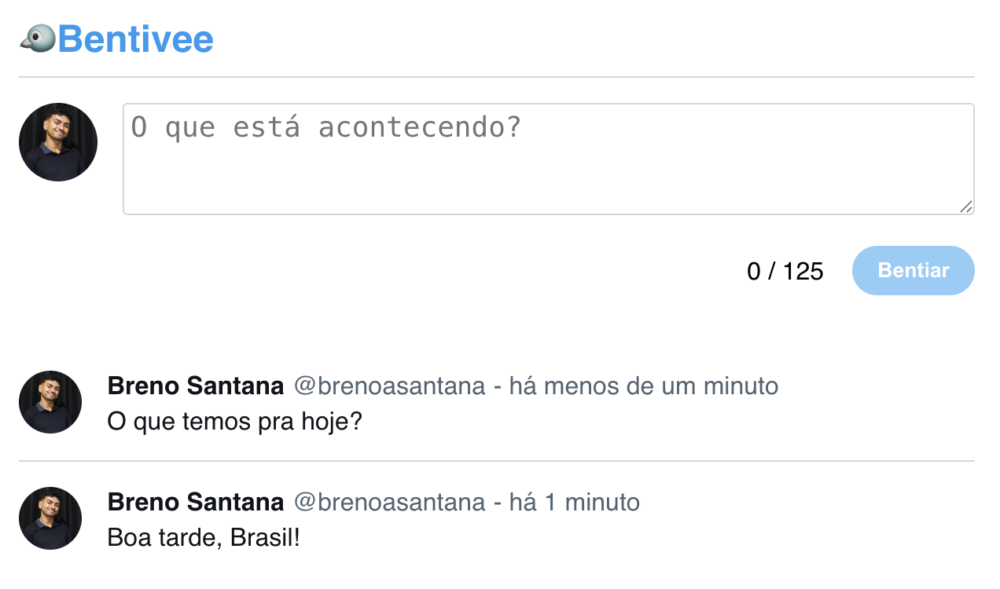

# 🐦 Bentivee - Clone do Twitter com ReactJS + Vite + Node.js

Bentivee é um projeto desenvolvido como parte de um curso de **Fundamentos de React** no LinkedIn Learning. Ele é um clone simplificado do Twitter — mas com um toque brasileiro: aqui os tweets se chamam **Bentis** 🐤✨

O projeto inclui um frontend moderno com React + Vite e um backend simples com **Node.js** para gerenciar os dados dos Bentis.

## 🚀 Tecnologias utilizadas

### Frontend
- ReactJS
- Vite
- JavaScript
- CSS Modules

### Backend
- Node.js

## 📸 Preview

 <!-- (adicione uma imagem do projeto rodando, se possível) -->

## 🔧 Funcionalidades

- Criar novos **Bentis** (postagens curtas, estilo Twitter)
- Listar os Bentes em tempo real
- Integração com backend Node.js
- Interface responsiva e moderna

## 🤝 Contribuição

Se quiser sugerir melhorias ou reportar bugs, fique à vontade para abrir uma *issue* ou fazer um *pull request*!

---

Feito com 💙 por [Breno Santana](https://github.com/brenoasantana)